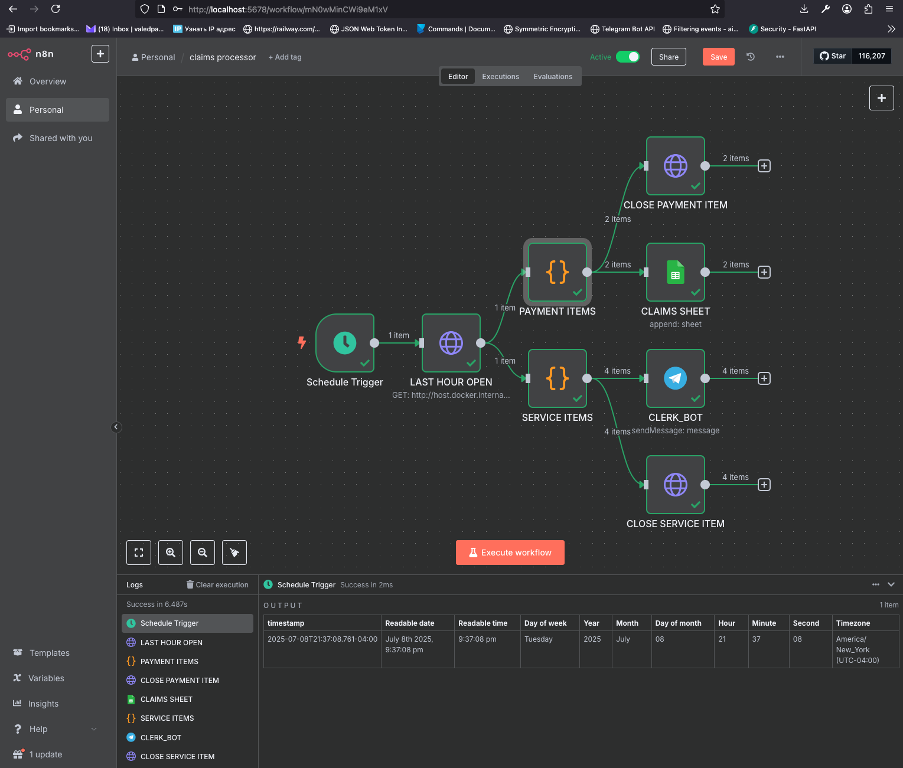
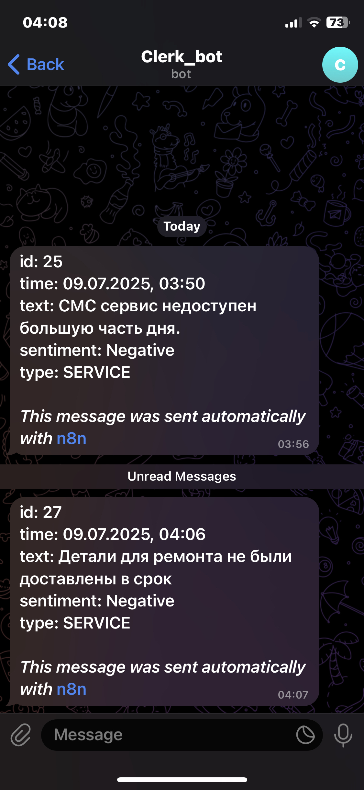
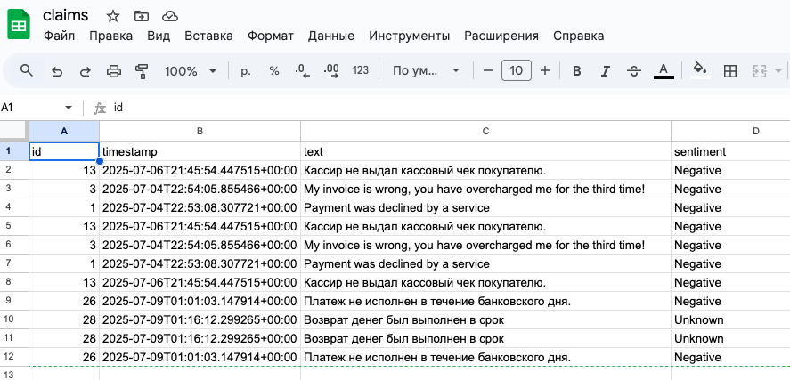
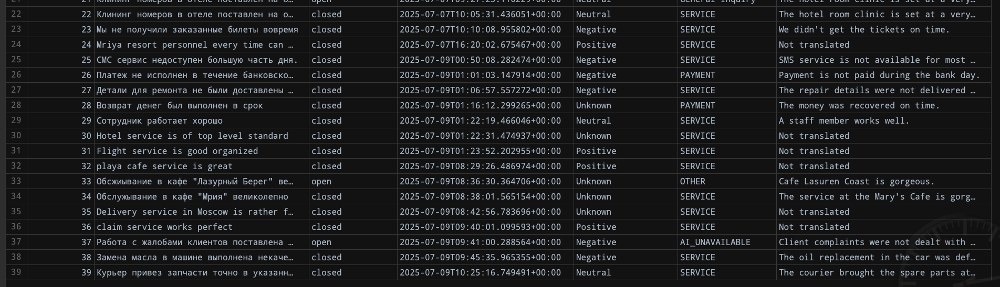

# Claims Processing API

FastAPI service for analyzing, categorizing, and managing customer claims with AI-powered processing.

## Key Features

- **Multi-stage Claim Processing**:
  - Automatic translation (RU→EN)
  - Sentiment analysis (API Layer)
  - Category detection (Ollama)
  - Priority ranking

- **Database Operations**:
  - Async SQLite storage
  - Claim status tracking
  - Time-based queries

- **Monitoring**:
  - Health check endpoint
  - Recent claims dashboard
  - Detailed logging

## Коротко о проекте

- n8n, Mistral запускаются в контейнерах
- категоризация двухэтапная:

    - сначала быстрая без запроса к API с использованием предустановленных сетов
    - если она неудачна, то запрашиваем Mistral

- проект содержит элементы production-ready (CI, config)
- при необходимости может быть приведен к production


## Tech Stack

| Component          | Technology                 |
|--------------------|----------------------------|
| Framework          | FastAPI                    |
| Async HTTP         | aiohttp                    |
| Database           | aiosqlite                  |
| NLP               | HuggingFace/Ollama/Mistral |
| Config Management  | Pydantic Settings          |
| Logging           | Loguru                     |

## Installation

1. Clone repository:
   ```bash
   gh repo clone valedpatri/claimatic

   poetry install --no-root

   uvicorn main:app --reload
    ```

[]()

[]()

[]()

[]()
